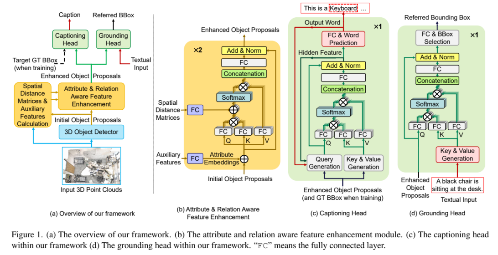
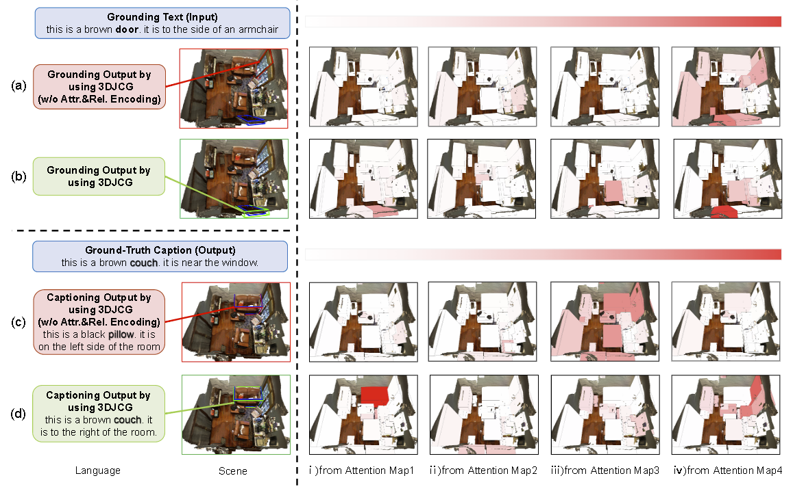
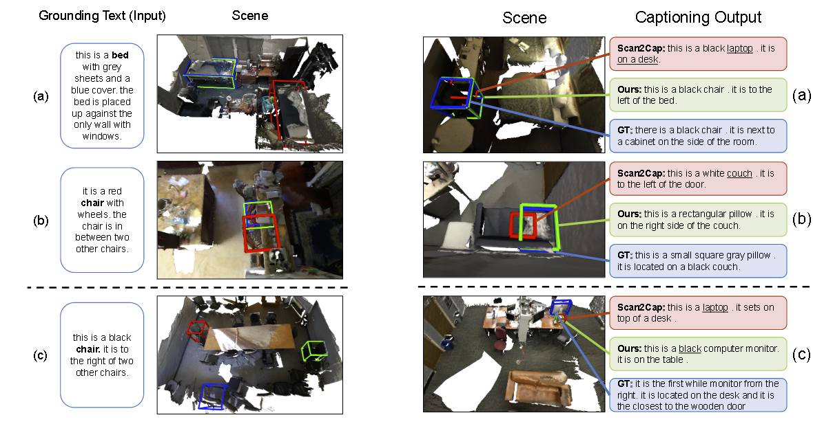

# 3DJCG: A Unified Framework for Joint Dense Captioning and Visual Grounding on 3D Point Clouds

This repository is for the **CVPR 2022** oral paper "[3DJCG: A Unified Framework for Joint Dense Captioning and Visual Grounding on 3D Point Clouds](https://openaccess.thecvf.com/content/CVPR2022/papers/Cai_3DJCG_A_Unified_Framework_for_Joint_Dense_Captioning_and_Visual_CVPR_2022_paper.pdf)"  

## Introduction

Observing that the 3D captioning task and the 3D grounding task contain both shared and complementary information in nature, in this work, we propose a unified framework to jointly solve these two distinct but closely related tasks in a synergistic fashion, which consists of both shared task-agnostic modules and lightweight task-specific modules. On one hand, the shared task-agnostic modules aim to learn precise locations of objects, fine-grained attribute features to characterize different objects, and complex relations between objects, which benefit both captioning and visual grounding. On the other hand, by casting each of the two tasks as the proxy task of another one, the lightweight task-specific modules solve the captioning task and the grounding task respectively. Extensive experiments and ablation study on three 3D vision and language datasets demonstrate that our joint training framework achieves significant performance gains for each individual task and finally improves the state-of-the-art performance for both captioning and grounding tasks. 




## Dataset & Setup

### Data preparation

*This codebase is built based on the initial [ScanRefer](https://github.com/daveredrum/ScanRefer)  and [3DVG-Transformer](https://github.com/zlccccc/3DVG-Transformer) codebase. Please refer to them for more data preprocessing details.*

1. Download the ScanRefer dataset and unzip it under `data/`. 
2. Downloadand the preprocessed [GLoVE embeddings (~990MB)](http://kaldir.vc.in.tum.de/glove.p) and put them under `data/`.
3. Download the ScanNetV2 dataset and put (or link) `scans/` under (or to) `data/scannet/scans/` (Please follow the [ScanNet Instructions](data/scannet/README.md) for downloading the ScanNet dataset).

> After this step, there should be folders containing the ScanNet scene data under the `data/scannet/scans/` with names like `scene0000_00`

4. Pre-process ScanNet data. A folder named `scannet_data/` will be generated under `data/scannet/` after running the following command. Roughly 3.8GB free space is needed for this step:

```shell
cd data/scannet/
python batch_load_scannet_data.py
```

> After this step, you can check if the processed scene data is valid by running:
>
> ```shell
> python visualize.py --scene_id scene0000_00
> ```

5. (Optional) Pre-process the **multiview features** from ENet.

- Download:
    Download the ENet [multiview features (~36GB, hdf5 database)](http://kaldir.vc.in.tum.de/enet_feats.hdf5) and put it under `data/scannet/scannet_data/`

- Projection:

   a. Download [the ENet pretrained weights (1.4MB)](http://kaldir.vc.in.tum.de/ScanRefer/scannetv2_enet.pth) and put it under `data/`
   b. Download and decompress [the extracted ScanNet frames (~13GB)](http://kaldir.vc.in.tum.de/3dsis/scannet_train_images.zip).
   c. Change the data paths in `lib/config.py` marked with __TODO__ accordingly.
   d. Project ENet features from ScanNet frames to point clouds (~36GB, hdf5 database).


> ```shell
> python script/project_multiview_features.py --maxpool
> ```

### Setup
The code is tested on Ubuntu 16.04 LTS & 18.04 LTS with PyTorch 1.2.0 CUDA 10.0 installed.

Please refer to the initial [ScanRefer](https://daveredrum.github.io/ScanRefer/) for **pointnet2 packages** for the newer version (>=1.3.0) of PyTorch.

You could use other PointNet++ implementations for the lower version (<=1.2.0) of PyTorch.

```shell
conda install pytorch==1.2.0 torchvision==0.4.0 cudatoolkit=10.0 -c pytorch
```

Install the necessary packages listed out in `requirements.txt`:
```shell
pip install -r requirements.txt
```
After all packages are properly installed, please run the following commands to compile the CUDA modules for the PointNet++ backbone:
```shell
cd lib/pointnet2
python setup.py install
```
__Before moving on to the next step, please don't forget to set the project root path to the `CONF.PATH.BASE` in `lib/*/config.py`.__

## Usage

### Training
To train the 3DVG-Transformer model with multiview features:
```shell
python scripts/joint_scripts/train_3djcg.py --use_multiview --use_normal --batch_size 8 --epoch 200 --lr 0.002 --coslr --num_ground_epoch 150 --tag 3djcg
```
settings:
XYZ: --use_normal
XYZ+RGB: --use_color --use_normal
XYZ+Multiview: --use_multiview --use_normal

### Evaluation
To evaluate the trained models, please find the folder under `outputs/` and run:
```shell
python scripts/joint_scripts/grounding_eval.py --folder <folder_name> --reference --use_multiview --no_nms --force --repeat 5 --lang_num_max 1
```
Note that the flags must match the ones set before training. The training information is stored in `outputs/<folder_name>/info.json`

Note that the results generated by ScanRefer_eval.py may be slightly lower than the test results during training. The main reason is that the results of model testing fluctuate, while the maximum value is reported during training, and we do not use a fixed test seed.

### Benchmark Challenge 

**Note that every user is allowed to submit the test set results of each method *only twice*, and the ScanRefer benchmark blocks update the test set results of a method for two weeks after a test set submission.**

After finishing training the model, please download [the benchmark data](http://kaldir.vc.in.tum.de/scanrefer_benchmark_data.zip) and put the unzipped `ScanRefer_filtered_test.json` under `data/`. Then, you can run the following script the generate predictions:

```shell
python scripts/joint_scripts/ground_predict.py --folder <folder_name> --use_multiview
```

Note that the flags must match the ones set before training. The training information is stored in `outputs/<folder_name>/info.json`. The generated predictions are stored in `outputs/<folder_name>/pred.json`.
For submitting the predictions, please compress the `pred.json` as a .zip or .7z file and follow the [instructions](http://kaldir.vc.in.tum.de/scanrefer_benchmark/documentation) to upload your results.

### Visualization





To predict the localization results predicted by the trained ScanRefer model in a specific scene, please find the corresponding folder under `outputs/` with the current timestamp and run:

```shell
python scripts/joint_scripts/caption_visualize.py --folder <folder_name> --scene_id <scene_id> --use_color
python scripts/joint_scripts/ground_visualize.py --folder <folder_name> --scene_id <scene_id> --use_color
python scripts/joint_scripts/heatmap_visualize.py --folder <folder_name> --scene_id <scene_id> --use_color
```
Note that the flags must match the ones set before training. The training information is stored in `outputs/<folder_name>/info.json`. The output `.ply` files will be stored under `outputs/<folder_name>/vis/<scene_id>/

The generated .ply or .obj files could be visualized in software such as **MeshLab**.

### Results

settings:
3D Only (XYZ+RGB): --use_color --use_normal
2D+3D (XYZ+Multiview): --use_multiview --use_normal

Dense Captioning：
|             |   Data  | C@0.25 | B-4@0.25 | M@0.25 | R@0.25 | C@0.5 | B-4@0.5 | M@0.5 | R@0.5 |
|:-----------:|:-------:|:------:|:--------:|:------:|:------:|:-----:|:-------:|:-----:|:-----:|
|   Scan2Cap  | 3D Only |  53.73 |   34.25  |  26.14 |  54.95 | 35.20 |  22.36  | 21.44 | 43.57 |
|     3DJCG    | 3D Only |  60.86 |   39.67  |  27.45 |  59.02 | 47.68 |  31.53  | 24.28 | 51.08 |
|             |         |        |          |        |        |       |         |       |       |
| VoteNetRetr | 2D + 3D |  15.12 |   18.09  |  19.93 |  38.99 | 10.18 |  13.38  | 17.14 | 33.22 |
|   Scan2Cap  | 2D + 3D |  56.82 |   34.18  |  26.29 |  55.27 | 39.08 |  23.32  | 21.97 | 44.48 |
|     3DJCG    | 2D + 3D |  64.70 |   40.17  |  27.66 |  59.23 | 49.48 |  31.03  | 24.22 | 50.80 |

Visual Grounding：
|  Validation Set  |             |          |  Unique  |  Unique | Multiple | Multiple |  Overall | Overall |
|:----------------:|:-----------:|:--------:|:--------:|:-------:|:--------:|:--------:|:--------:|:-------:|
|      Methods     | Publication | Modality | Acc@0.25 | Acc@0.5 | Acc@0.25 |  Acc@0.5 | Acc@0.25 | Acc@0.5 |
|       SCRC       |    CVPR16   |    2D    |   24.03  |   9.22  |   17.77  |   5.97   |   18.70  |   6.45  |
|     One-Stage    |    ICCV19   |    2D    |   29.32  |  22.82  |   18.72  |   6.49   |   20.38  |   9.04  |
|                  |             |          |          |         |          |          |          |         |
|     ScanRefer    |   ECCV2020  |    3D    |   67.64  |  46.19  |   32.06  |   21.26  |   38.97  |  26.10  |
|       TGNN       |   AAAI2021  |    3D    |   68.61  |  56.80  |   29.84  |   23.18  |   37.37  |  29.70  |
|   InstanceRefer  |   ICCV2021  |    3D    |   77.45  |  66.83  |   31.27  |   24.77  |   40.23  |  32.93  |
|        SAT       |   ICCV2021  |    3D    |   73.21  |  50.83  |   37.64  |   25.16  |   44.54  |  30.14  |
| 3DVG-Transformer |   ICCV2021  |    3D    |   77.16  |  58.47  |   38.38  |   28.70  |   45.90  |  34.47  |
|    BEAUTY-DETR   |      -      |    3D    |     -    |    -    |     -    |     -    |   46.40  |    -    |
|      3D-SPS      |   CVPR2022  |    3D    |   81.63  |  64.77  |   39.48  |   29.61  |   47.65  |  36.43  |
|       3DJCG      |   CVPR2022  |    3D    |   78.75  |  61.30  |   40.13  |   30.08  |   47.62  |  36.14  |
|                  |             |          |          |         |          |          |          |         |
|     ScanRefer    |   ECCV2020  |  2D + 3D |   76.33  |  53.51  |   32.73  |   21.11  |   41.19  |  27.40  |
|       TGNN       |   AAAI2021  |  2D + 3D |   68.61  |  56.80  |   29.84  |   23.18  |   37.37  |  29.70  |
|   InstanceRefer  |   ICCV2021  |  2D + 3D |   75.72  |  64.66  |   29.41  |   22.99  |   38.40  |  31.08  |
| 3DVG-Transformer |   ICCV2021  |  2D + 3D |   81.93  |  60.64  |   39.30  |   28.42  |   47.57  |  34.67  |
|     MVT-3DVG     |   CVPR2022  |  2D + 3D |   77.67  |  66.45  |   31.92  |   25.26  |   40.80  |  33.26  |
|      3D-SPS      |   CVPR2022  |  2D + 3D |   84.12  |  66.72  |   40.32  |   29.82  |   48.82  |  36.98  |
|       3DJCG      |   CVPR2022  |  2D + 3D |   83.47  |  64.34  |   41.39  |   30.82  |   49.56  |  37.33  |


## Changelog

2022/07: Release the codes of 3DJCG.

2021/03: 3DJCG is accepted at CVPR 2022 as an oral paper.

2021/11: 3DJCG achieves 1st place in [ScanRefer Leaderboard](http://kaldir.vc.in.tum.de/scanrefer_benchmark/).

## Citation

If you use the codes in your work, please kindly cite our work 3DVG-Transformer and the original ScanRefer paper:

```
@inproceedings{cai20223djcg,
  title={3DJCG: A Unified Framework for Joint Dense Captioning and Visual Grounding on 3D Point Clouds},
  author={Cai, Daigang and Zhao, Lichen and Zhang, Jing and Sheng, Lu and Xu, Dong},
  booktitle={Proceedings of the IEEE/CVF Conference on Computer Vision and Pattern Recognition},
  pages={16464--16473},
  year={2022}
}

@inproceedings{zhao2021_3DVG_Transformer,
    title={{3DVG-Transformer}: Relation modeling for visual grounding on point clouds},
    author={Zhao, Lichen and Cai, Daigang and Sheng, Lu and Xu, Dong},
    booktitle={ICCV},
    pages={2928--2937},
    year={2021}
}

@article{chen2020scanrefer,
    title={{ScanRefer}: 3D Object Localization in RGB-D Scans using Natural Language},
    author={Chen, Dave Zhenyu and Chang, Angel X and Nie{\ss}ner, Matthias},
    pages={202--221},
    journal={ECCV},
    year={2020}
}
```

## Acknowledgement
We would like to thank [facebookresearch/votenet](https://github.com/facebookresearch/votenet) for the 3D object detection codebase and [erikwijmans/Pointnet2_PyTorch](https://github.com/erikwijmans/Pointnet2_PyTorch) for the CUDA accelerated PointNet++ implementation.

For further acceleration, you could use [KD-Tree](https://github.com/zlccccc/3dpoint_cuda_kdtree) to accelerate the PointNet++ process.

## License

This repository is released under MIT License (see LICENSE file for details).
